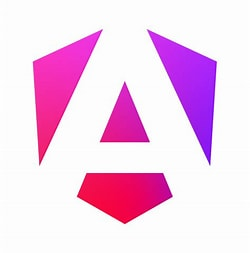

<p align="center">
  
  
</p>

<p align="center">

  <a href="https://github.com/spring-projects/spring-boot/actions"></a>
  <a href="https://www.npmjs.com/package/@angular/core"></a>
  <a href="https://search.maven.org/artifact/org.springframework.boot/spring-boot-starter"></a>
  <a href="https://opensource.org/licenses/MIT"></a>
</p>

## About Project


# CHU Emergency — Responsive Web Application for Hospital Interconsultation Management

## Project Overview
CHU Emergency is a responsive web application designed to streamline and manage interconsultations in a hospital emergency department. The system provides an intuitive interface for medical staff to coordinate, track, and manage patient consultations across multiple services.

## Technologies Used
- **Frontend:**
  - Angular 19
  - TypeScript
  - HTML, CSS
  - PrimeNG, primeicons

- **Backend:**
  - Spring Boot 3.5.x
  - Java 21
  - Spring Data JPA (Hibernate)

- **Database:**
  - Microsoft SQL Server

- **Development Environment:**
  - Visual Studio Code
  - Maven (wrapper included)
  - Node.js & npm

## Key Features
1. **Responsive Design:**
   - Mobile-friendly interface using Angular and PrimeNG.
   - Consistent user experience across devices.

2. **Interconsultation Management:**
   - Create, view, and track interconsultation requests between hospital services.
   - Real-time updates and notifications for new or updated consultations.

3. **User Roles:**
   - Role-based access for doctors, laboratory staff, radiology, and admin.
   - Secure authentication and authorization.

4. **Patient & Doctor Management:**
   - Manage patient records and doctor profiles.
   - View consultation history and status.

5. **Data Synchronization:**
   - Real-time data updates between backend and frontend.
   - Ensures all users see the latest information instantly.

6. **Database Management:**
   - Efficient storage and retrieval of consultation data using SQL Server.
   - Supports complex queries and robust data integrity.

## Setup Instructions
### Prerequisites
- Java 21 JDK
- Maven 3.8+ (or use the included Maven wrapper)
- Node.js 18+ and npm 9+
- (Optional) Angular CLI: `npm i -g @angular/cli@~19`

### Backend Setup (Spring Boot)
1. Navigate to `Backend/urgences-backend`
2. Configure your database in `src/main/resources/application.properties`:
   ```properties
   spring.datasource.url=jdbc:sqlserver://<HOST>:<PORT>;databaseName=<DB>
   spring.datasource.username=DB_USER
   spring.datasource.password=DB_PASSWORD
   ```
3. Build and run:
   ```powershell
   .\mvnw.cmd clean package -DskipTests; .\mvnw.cmd spring-boot:run
   ```
4. The API will be available at `http://localhost:8080/api`

### Frontend Setup (Angular)
1. Navigate to `urgences-frontend`
2. Install dependencies:
   ```powershell
   npm install
   ```
3. Start the development server:
   ```powershell
   npm start
   # or
   ng serve --open
   ```
4. Access the app at `http://localhost:4200`

**Note:** The frontend communicates with the backend via the API endpoint defined in `src/app/service/interconsultation/data-table-interconsultation.service.ts`. Ensure the URL matches your backend configuration.

## Usage

- **Doctor Portal:**
  - Log in to view, create, and manage interconsultation requests.
  - Track patient status and consultation history.

- **Laboratory & Radiology:**
  - View and respond to consultation requests relevant to your service.

- **Admin:**
  - Manage user roles, services, and system configuration.

## Future Enhancements
- **Advanced Reporting:**
  - Analytics and reporting tools for consultation statistics and outcomes.
- **Notifications:**
  - Real-time notifications for new consultations and status changes.
- **API Integration:**
  - RESTful API for third-party integrations and mobile applications.
- **Security:**
  - Enhanced data encryption and audit logging.

## License

This project is open-sourced software licensed under the [MIT license](https://opensource.org/licenses/MIT).
